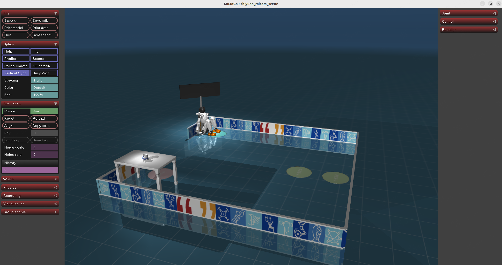
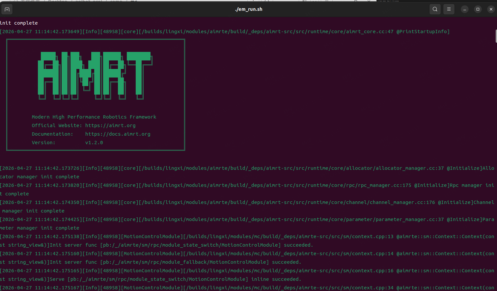

# 操作手册
## 环境要求

推荐使用 docker 方式运行仿真环境，如需本地运行仿真，请仿照 dockerfile/Dockerfile 中的内容自行安装对应依赖等。以下教程均基于 docker 方式运行。

1. 安装有 docker 的 x86 架构 linux 系统电脑

   1. docker 安装教程：https://docs.docker.com/engine/install/

   2. 确保可以正常运行 `docker run hello-world`

2. 使用 x11 桌面系统

   * 可以通过 `echo $XDG_SESSION_TYPE` 来检测，输出 x11 为期望现象

3. 系统性能不太低，可流畅运行 mujoco 仿真，无需 GPU 加速


## 获取 mc 、sim_mujoco 以及aimdk_msgs 包
可在赛事交流群获取。您将获得三个包：
* mc_x86_v1.0.0_raicom26.zip：机器人控制模块，用于控制机器人运动
* sim_mujoco-x86-v1.0.0-raicom26.zip：仿真环境，用于模拟机器人在真实世界中的运动
* aimdk-aarch64-1bde262f-artifacts.zip：消息定义，用于通信


将下载的三个包解压到Raicom2026路径的根目录下，目录结构如下：
```bash
Raicom2026
├── aimdk-aarch64-1bde262f-artifacts <----------- aimdk_msgs 包
├── Dockerfile
├── document
│   └── images
├── mc <----------- mc 预编译包
├── sim_mujoco <----------- sim_mujoco 预编译包
├── example
└── README.md
```

## 镜像构建
在Raicom2026路径的根目录下。运行如下指令
```
docker build -t lingxi-x2-env:v1.0 .
```
初次运行时间较长，请耐心等待镜像构建完成，下载源替换为中国境内易访问源以加速下载，如遇某步骤下载缓慢甚至卡死请尝试切换网络环境后重试。

若 docker build 过程拉取基础镜像超时，需自行配置镜像源。

### UID/GID 权限说明

Dockerfile 默认会在镜像中创建 `agi` 用户，默认 UID/GID 均为 `1001`。如果宿主机当前用户不是 `1001:1001`，挂载当前目录到容器后，可能出现容器内无法写入工作目录、生成文件归属异常等权限问题。

推荐在构建镜像时将容器用户 UID/GID 设置为宿主机当前用户：

```bash
docker build \
  --build-arg USER_UID=$(id -u) \
  --build-arg USER_GID=$(id -g) \
  -t lingxi-x2-env:v1.0 .
```

如需保留默认值，也可以继续使用：

```bash
docker build -t lingxi-x2-env:v1.0 .
```

成功后可执行以下命令检查镜像是否已经存在

```bash
docker images | grep lingxi-x2-env
```
如果下载仍超时，可尝试下放操作：

```
#终端输入：
sudo nano /etc/docker/daemon.json

#将下述指令写入上述文件（换源地址根据实际情况修改）
{
  "registry-mirrors": [
    "https://docker.1ms.run",
    "https://docker.xuanyuan.me",
    "https://docker.m.daocloud.io"
  ]
}

#重启docker服务
sudo systemctl daemon-reload
sudo systemctl restart docker
```


## 镜像启动
首先在宿主机上运行以下命令，使得容器内可以运行 GUI 程序显示仿真窗口

> 允许docker访问显示器，用于配置 X Window System 的访问控制列表。执行 xhost + 会允许所有的主机连接到当前用户的 X 服务器，这样做会取消 X 服务器的访问控制，从而允许任何用户访问和操作 X 服务器。

```bash
xhost +
```

进入部署仓库目录后，可以通过如下命令启动镜像：

```bash
docker run -it \
  --name=x2_deploy \
  --privileged \
  --net=host \
  --ipc=host \
  --pid=host \
  -e DISPLAY=$DISPLAY \
  -v /dev/input:/dev/input \
  -v /tmp:/tmp \
  -v /run/dbus/system_bus_socket:/run/dbus/system_bus_socket:ro \
  -v .:/home/agi/x2_deploy_workspace \
  -d lingxi-x2-env:v1.0
```
如果发现使用 NVIDIA 显卡的机器使用上述命令开启容器后仿真界面运行卡顿，可以尝试使用以下命令开启容器：

```bash
docker run -it \
  --name x2_deploy \
  --gpus all \
  --privileged \
  --net=host \
  --ipc=host \
  --pid=host \
  -e DISPLAY=$DISPLAY \
  -e NVIDIA_VISIBLE_DEVICES=all \
  -e NVIDIA_DRIVER_CAPABILITIES=all \
  -v /dev/input:/dev/input \
  -v /tmp:/tmp \
  -v /run/dbus/system_bus_socket:/run/dbus/system_bus_socket:ro \
  -v .:/home/agi/x2_deploy_workspace \
  -d lingxi-x2-env:v1.0
```

## 编译 aimdk_msgs 包
开启一新的终端执行如下指令：
```bash
# 进入容器环境
docker start x2_deploy && docker exec -it x2_deploy /bin/bash     

# 开始编译构建
cd  /home/agi/x2_deploy_workspace/aimdk-aarch64-1bde262f-artifacts

colcon build 

#将构建产物复制到指令目录下
cp -r ./install/aimdk_msgs/ ../
``` 

## 启动仿真
开启一新的终端执行如下指令：
```bash
# 进入容器环境
docker start x2_deploy && docker exec -it x2_deploy /bin/bash     

# 启动仿真
cd /home/agi/x2_deploy_workspace/sim_mujoco/bin
./start_sim.sh   
``` 
正确启动后将看到如下界面：



## 启动运动控制模块
开启一新的终端执行如下指令：
```bash
# 进入容器环境
docker start x2_deploy && docker exec -it x2_deploy /bin/bash     

# 启动mc
cd /home/agi/x2_deploy_workspace/mc/bin
./em_run.sh   
```  
正确启动后将看到如下界面：


## 运行示例代码
开启一新的终端执行如下指令：

```bash
# 进入容器环境
docker start x2_deploy && docker exec -it x2_deploy /bin/bash     

# 启动example
cd /home/agi/x2_deploy_workspace/example/py
python3 set_mode.py    #选择SD 模式后，点击仿真的Reset 按钮 

```  
选择SD 模式后，点击仿真的Reset 按钮， 可以在仿真中看到机器人稳定站立。

其他示例代码可参考 [AimDK_X2 官方开发手册](https://x2-aimdk.agibot.com/zh-cn/latest/index.html)
